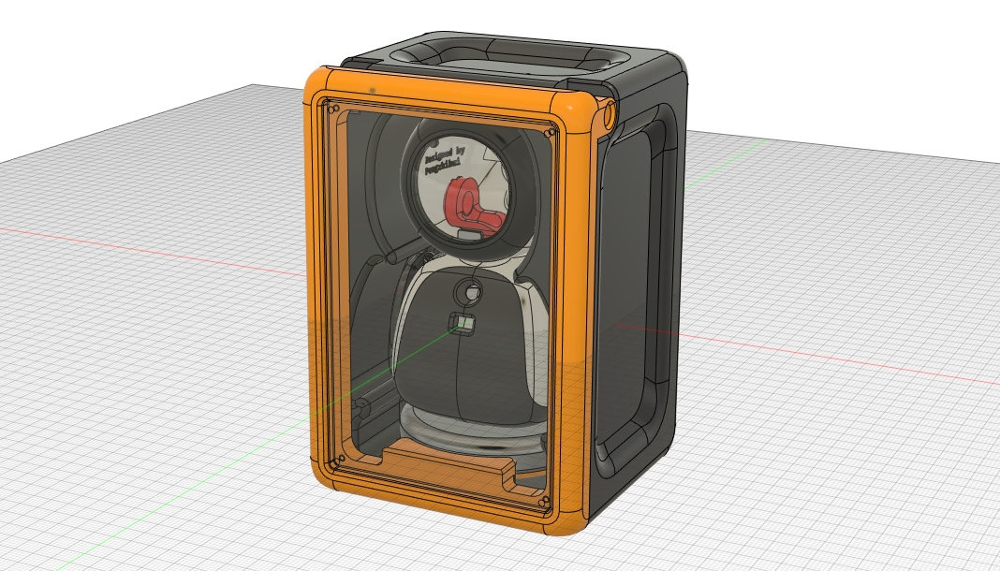
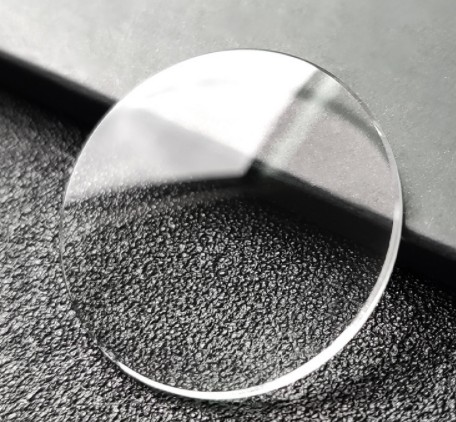

<h1 align="center">ElectronBot: Mini Desktop Robot</h1>

  
<!--  -->

<i>喜欢这个项目吗？请考虑给 Star ⭐️ 以帮助改进！</i>

---

> 本项目是一个桌面级小机器工具人，外观设计的灵感来源是WALL-E里面的EVE~机器人具备USB通信显示画面功能，具备6个自由度（手部roll、pitch，颈部，腰部各一个），使用自己修改的特制舵机支持关节角度回传。
>
> 本项目提供了配套的全套开发资料和对应SDK以供二次开发，SDK使用说明见后文。
>
> **视频介绍**：[【自制】我做了个能动的 电 脑 配 件！【软核】_哔哩哔哩](https://www.bilibili.com/video/BV1ka411b76m/)
>
> **Video** : [I made a cute mini desktop robot ! - YouTube](https://www.youtube.com/watch?v=F29vrvUwqS4)

**注意：Issues里面是讨论项目开发相关话题的，不要在里面发无意义的消息，不然watch了仓库的人都会收到通知邮件会给别人造成困扰的！！！灌水可以在仓库的Discuss里讨论！**

---

### 更新说明：

**22.4.5更新：**

* 添加单独的USB通信功能测试工程以及预编译文件，在`6.Tests\TestDisplayUSB\_Released`目录；使用方法是直接给STM32F4烧录hex文件，然后直接在电脑端运行`Sample.exe`，硬件正常的话屏幕会显示文件夹里的视频。
* 上述预编译文件的源码和固件也在文件夹里有提供，相当于一个最小测试工程，可以自己查看代码进行调试。
* 注意在6个舵机没有测试验证成功之前，调试代码不要使用舵机收发指令的功能，不然总线会阻塞导致程序卡住，推荐的方式是先单独一个一个功能调试，完成了之后再整合做联调。

> 安装教程可以参考：
>
> [数码甲鱼的简单生活](https://space.bilibili.com/1668139036) 同学的胎教级教程：https://www.bilibili.com/video/BV1sY4y1Y7t6
>
> [绿荫阿广](https://space.bilibili.com/25228512)同学的安装视频 ：https://www.bilibili.com/video/BV1oY4y1v7oN

**22.4.17更新：**

* 添加语音识别版电子，感谢[jinsonli/ElectronBot-Voice ](https://github.com/jinsonli/ElectronBot-Voice)的分享，演示效果可以看这个视频：[我复刻了电脑配件机器人electronbot【语音版】](https://www.bilibili.com/video/BV18a411v7JS)
* 视频中演示的舵机调试工具已添加到本仓库

### 1.项目文件说明 

#### 1.1 Hardware

Hardware文件夹内是ElectronBot里面用到的所有电路的原理图和PCB文件，提供Altium Designer格式的源文件以及Gerber格式的光绘文件用于提供给厂家进行直接加工。

一共有如下几块板子：

* **ElectronBot**：头部的主控板，包含主控MCUSTM32F405RGT6，圆形屏幕GC9A01，USB-HS的PHY芯片USB3300，以及SD卡。
* **SensorBoard**：肚子里的传感器板子，包含一个手势传感器，一个USB-HUB芯片，5个I2C舵机的接口，一个MPU6050加速度计&陀螺仪等（USB摄像头也是连接到这个板子的）。

* **BaseConnector**：底座上的USB Type-C插座，通过8-Pin的FFC排线和SensorBoard连接，因为机器人本体需要旋转所以使用了柔性排线。
* **ServoDrive**：用于魔改舵机替换舵机驱动板的电路，通过I2C总线接口和SensorBoard以及头部主控连接。

* **ServoDrive-DK**：同上，但是把PCB的触点接口换成了接插件，方便调试，调试完了下载代码到上面的板子（因为体积太小所以上面的板子没有下载口接插件，所以不方便调试，这里单独提供一个DK版本）。

#### 1.2 Firmware

Firmware中提供了上面所有板子的固件源码，主要包含以下两个工程：

* **ElectronBot-fw**：头部主控板的固件代码，用于驱动圆形屏幕，实现USB-CDC协议的自定义设备，以及进行舵机控制。
* **ServoDrive-fw**：ServoDrive板子的固件，包含舵机的电位器ADC采样，I2C从机通信和协议解析，电机控制的PWM输出，以及PID闭环算法实现。
* **ServoDrive-fw-LL**：也是ServoDrive板子的固件，与上面不同的是改用LL库而不是HAL库实现，所以Flash占用会小一些，可以放进16K的MCU，大家根据自己的情况选择需要的固件。

工程都是基于STM32HAL实现的，所以提供了对应的`.ioc`文件，可以自行用STM32CubeMX打开，生成对应的keil或者STM32IDE工程文件。当让也可以像我一样，用CLion进行编译和下载，把CLion变成STM32的IDE的方法参考我之前发的一篇教程：[配置CLion用于STM32开发【优雅の嵌入式开发】](https://zhuanlan.zhihu.com/p/145801160) 。

#### 1.3 Software

Software中提供了视频里演示的上位机软件ElectronStudio的Unity工程源码，以及SDK库和SDK源文件，库的层级关系由下至上分别是：

`ElectronBotSDK-LowLevel` -> `ElectronBotSDK-Player` -> `ElectronBotSDK-UnityBridge` -> `Electron-Studio`

> SDK的使用方法见后文。

此外文件夹里还包含了BotDriver也就是ElectronBot连接电脑需要安装的USB驱动文件，安装方法是在设备管理器里右键更新驱动，然后选择自定义目录导航到这个文件夹即可安装。

> 安装过程需要禁用Windows的强制驱动签名（没钱给M$买签名），禁用方法根据你的操作系统版本有不同，可以百度一下。

#### 1.4 CAD-Model

文件夹中包含了ElectronBot的结构设计图纸，`.step`通用格式可以在所有软件里打开编辑；同时为了满足有的同学想要Fusion360里面的原始工程，我也共享了`.f3d`格式源文件，源文件里包含了完整的编辑建模时间轴。

共享连接：https://a360.co/3t6CUMS

此目录下也包含了视频里演示的[oooooohmygosh](https://space.bilibili.com/38053181)同学设计的表情包动画，其中每个表情的动画都包含了三个片段：`进入-循环-退出`，进入和退出是可以和其他动画进行无缝衔接的，因此可以方便用代码调用这些表情包实现很多效果。

> 表情文件需要修改为英文名和路径后使用。

我把视频结尾提到的收纳盒也上传了，可以用FDM打印，5%填充即可。

#### 1.5 Docs

相关的参考文件，包括芯片的Datasheet等。

此目录下还有个_LargeFiles文件夹，是软件过程项目中依赖的一些库（比如OpenCV）因为DLL比较大超过了100MB，GitHub需要开启LFS才能提交，而我不想开启LFS，因此单独拿出来压缩了提交到仓库，编译工程的时候需要把这些库放到对应工程目录下，具体的路径见 `_path.txt`。

### 2.硬件架构说明

机器人的硬件分为**结构**和**电路**。

#### 2.1 结构设计

结构设计方面大家可以研究3D图纸，值得注意的点如下：

**主要部件的加工方式？**

* 我是用3D打印加工的，因为包含了齿轮等精密部件，传统FDM打印的精度可能不太理想，光固化是可以的，但是支撑问题可能导致打印机表面不平整，而且LCD光固化的零件强度不太够。所以推荐使用HP尼龙打印，可以去嘉立创（三维猴）打印，价格这几个零件加起来应该是200-300元左右。
* 也用到了几个轴承和一些特殊的螺丝，轴承型号的话肩膀关节的型号是`6x10x3mm`，腰部轴承型号是`25x32x4mm`。特殊螺丝是肩膀roll自由度的推杆，使用了`M2x25mm`的半牙螺丝。

* 手臂推杆还用到了一个小挡块，这个挡块不用打印加工，直接用一段橡胶电线剪下一小段即可（视频里有演示），这个挡块是需要和推杆的螺丝固定到一起的，可以使用502粘合。

**手臂的驱动原理？**

* 视频里其实演示了，我自己设计了一个比较巧妙的驱动方式，pitch方向运动很好理解就是齿轮传动，roll方向使用了T型推杆如下：

  

* 推杆被M2螺丝的帽以及一个挡块限制住，当黄色的组件转动的时候，带动推杆左右移动，而推杆的另一端在手臂组件内由一个导槽限制运动方向从而将动力传递到转轴，此方案的力矩是可以双向传递的

  

**脸部的透明玻璃如何制作的**

* tb搜索`表蒙子`，我用的`31.5mm`直径的。

  

**安装顺序？**

可以参考这位[绿荫阿广](https://space.bilibili.com/25228512)同学的安装视频 ：https://www.bilibili.com/video/BV1oY4y1v7oN

* 安装过程中还有一点值得注意的是，因为机身体积太极限，几个舵机的安装架有的是需要剪短一边的不然塞不下，然后如果自己的打印机比较脆螺丝固定不牢的话，也可以使用热熔胶固定。
* 另外手臂的推杆可以稍微打磨一下并加上润滑脂使其推动更顺畅。

#### 2.2 电路设计

电路没啥好分析的，直接看原理图吧。

值得提一下的是USB-HUB的拓扑，如下：

**关于芯片选型？**

* 主控的STM32F4，这个不可替换，因为F4以下的型号不支持USB-HS外接PHY。
* 舵机驱动的STM32F0，这个可以替换，而且建议有能力的同学替换，因为我项目中用到的STM32F042P6芯片比较贵（买的十多元一片），而舵机驱动对于芯片的性能要求没那么高，完全可以用STM8之类的8位MCU替代，所以大家可以参考我的固件源码寻求能够替换的MCU改进一下方案。
* 替换STM32F0的MCU需要支持以下特性：带一个ADC采样、带两路PWM输出、带一个I2C接口，Flash和SRAM大小根据我的代码需要32K和4K或者更大（我固件用了HAL库以及C++特性，如果你可以基于LL库或者不适用C++的话应该需求还可以小一半）。

**关于烧录方式？**

* 使用JLink、STLink之类的调试器烧录，注意驱动板因为体积限制只留了三个烧录触点，需要使用`SH1.0`的接插件接触进行烧写。

**关于舵机的改造？**

* 通常的RC-Servo都是使用电位器进行绝对角度的测量的，因此我在驱动板中也是使用ADC读取电位器的电压值转换成角度反馈，而驱动芯片使用了我找到的封装最小的一个芯片`FM116B`。大家改造舵机的时候，注意区分电机两根接线的方向，如果调试发现电机不闭环的话，可能需要交换一下接线顺序。

* 另外那个小的3g舵机的改造需要把盖子拆开去掉（空间实在是太小加了盖子驱动塞不进去），然后去掉了后盖的舵机需要换成M1x10mm的螺丝进行固定不然会散架的。

  > 其实最理想的情况是找舵机厂家定制一个这样的迷你舵机，但是因为我一个人小批量做人家肯定不接单的，大家有渠道的话可以尝试一下。

**关于摄像头选型？**

* 我是用的是这款：https://item.taobao.com/item.htm?id=567717780577

  

* 当然大家可以根据需要自己替换别的USB摄像头（黑白的、高帧率的），只要塞得下就行，摄像头是直接拆了接线焊在SensorBoard上的 。

  > 值得注意的是，**我用的USB-HUB芯片的1拖4的**，目前使用了三个口，还剩一个其实可以再集成一个USB麦克风，这样ElectronBot也能当作电脑的麦克风使用了。 

### 3.软件架构说明

#### 3.1 固件代码

固件代码的细节和流程说明比较繁琐，晚点我慢慢补充吧，总之可以直接基于前面提到的方式进行编译下载，然后慢慢研究源码。

> STM32F4的源码如果通过`.ioc`重新生成工程的话，记得要把USB相关的几个文件预先备份，生成完代码后再替换回我原来的文件，因为CubeMX会覆盖生成把相关代码修改掉（我实际是使用Git的文件版本回退操作的 ）。

#### 3.2 舵机I2C协议

魔改后的舵机通过I2C接口和控制板进行通信，STM32F4的控制板为主机，舵机为从机。通信的过程始终是主机发起的，主机首先下发位置、参数等指令，然后即时取回相关数据完成一个通信来回。

每个舵机作为从机接收两个地址的指令：**自己的ID号**，以及**0号广播**。广播用于在没有给舵机设置地址的时候作为通配地址使用（比如你刚烧写完舵机固件，此时舵机的Flash是没有储存自己的ID的，只能通过0号地址通信）。

**值得注意的是：舵机和主机的上电需要有先后顺序，一定要先让从机初始化完成开始监听数据，再让主机发送指令！**

> 如果主机发送指令的时候从机不响应，或者多个舵机地址相同同时响应，都可能引起通信错误，因此需要保证上述的顺序。
>
> 由于硬件上主机和舵机上电都是同时的，所以在主机的固件代码中，有一个延时2S的代码（其实可以不用那么久），就是等待舵机都上电初始化完成再开始通信。
>
> 调试的时候，一个舵机一个舵机调试，注释掉其他未连接的舵机的通信代码，不然也会造成轮询等待超时。

关于舵机的指令含义，感谢 **[leazer](https://github.com/leazer)** 同学在Issues整理的表格：

> 指令后续可能会更新。

#### 3.3 SDK使用说明

SDK架构设计如图：

具体的使用方法可以参考SDK工程中给出的`sample.cpp`，我是用CLion+MSVC工具链编译的，大家也可以把源码复制到自己的Visual Studio工程编译。

`ElectronBotSDK-UnityBridge`工程编译生成的DLL文件需要拷贝到`Unity\ElectronBot-Studio\Assets\Plugins`目录下，用于连接本地的C++代码和Unity中C#环境。

> **对了，注意ElectronStudio中目前选择图片视频文件还不支持中文路径！**

关于SDK的具体实现细节可以阅读源码，我晚点有空也会再更新描述。

### 有的问题在Issues里面已经解答了，问问题之前先翻一下open/closed的Issues。

> 感谢以下项目：
>
> [opencv/opencv: Open Source Computer Vision Library (github.com)](https://github.com/opencv/opencv)
>
> https://github.com/CMU-Perceptual-Computing-Lab/openpose
>
> [Lexikos/AutoHotkey_L: AutoHotkey - macro-creation and automation-oriented scripting utility for Windows. (github.com)](https://github.com/Lexikos/AutoHotkey_L)
>
> https://blog.csdn.net/pq8888168/article/details/85781908

